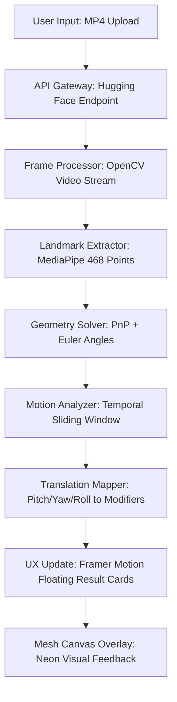

# VividHead: The Anti-Gravity ISL Interpreter

VividHead is a full-stack AI system that converts Indian Sign Language (ISL) non-manual head movements into text-level grammatical modifiers.

## Vision

The platform focuses on Non-Manual Features (NMFs), specifically head dynamics:
- Nodding (pitch oscillation) -> affirmation
- Shaking (yaw oscillation) -> negation
- Tilting (roll oscillation) -> question/uncertainty

The UX follows an anti-gravity visual identity with glassmorphism, floating cards, and high-frequency motion transitions.

## Tech Stack

- Backend: FastAPI + OpenCV + MediaPipe Face Mesh + PnP geometry solver (Hugging Face Space)
- Frontend: Next.js 14 App Router + Tailwind CSS + Framer Motion + Canvas neon mesh layer (Vercel)
- Model Input: `.mp4` videos sourced from categorized ISL phrase folders

## Architecture Flow



## Repository Structure

- `backend/`: FastAPI API, head pose math, Docker image for Hugging Face Spaces
- `frontend/`: Next.js app, upload flow, mesh visualization, animated modifier badges
- `dataset/`: categorized ISL phrase folders with source video files

## Quick Start

### 1) Backend setup

```bash
cd backend
python -m venv venv
# Windows
venv\Scripts\activate
# macOS/Linux
# source venv/bin/activate
pip install --upgrade pip
pip install -r requirements.txt
uvicorn app:app --reload --host 0.0.0.0 --port 7860
```

### 2) Frontend setup

```bash
cd frontend
npm install
cp .env.example .env.local
npm run dev
```

Open `http://localhost:3000` and upload an `.mp4` to test the full pipeline.

## Deployment Targets

- Backend Space: <https://huggingface.co/spaces/01mayankk/computervision-backend>
- Frontend Platform: Vercel (Edge Runtime where possible)
